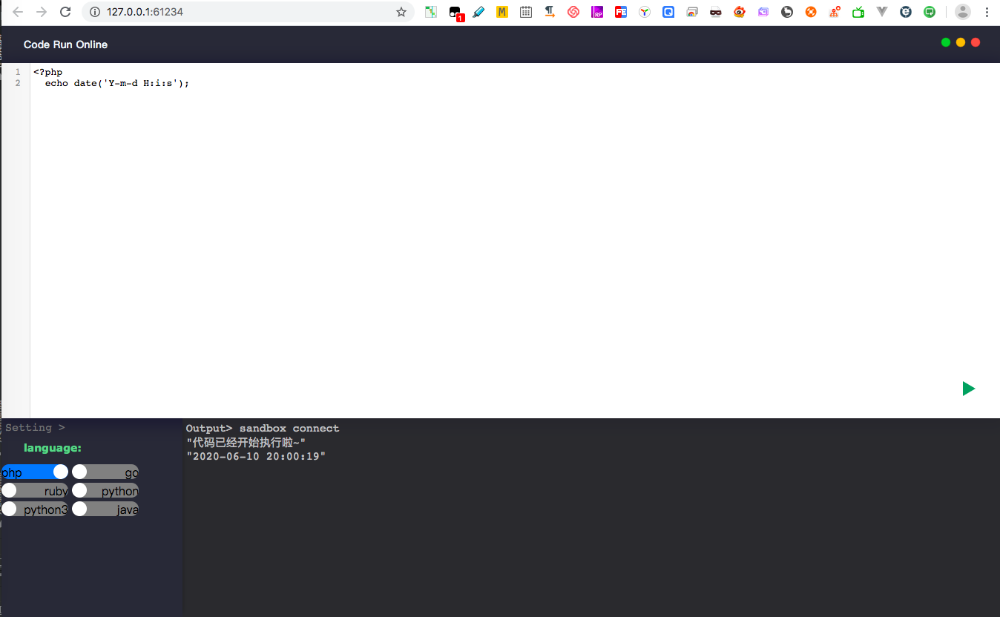

# code-run-online
代码在线测试 可能是最简单的实现了

# 关于
想在本地测试一些语言 由于不想编辑器之间来回折腾 而且市面上的在线太慢了 就整了个这个 感觉挺好用的就顺手丢了上来

# 语言支持
* PHP
* GO
* Java
* Ruby
* Python
* C
* ...

# 使用方法
1. npm install
2. node run-online.js
3. 浏览器打开 http://127.0.0.1:61234
4. 开始你的表演

# 模板引擎
pug

# 截图
talk is cheap, show me code

# 待优化问题
1. 切换语言时的默认代码
2. 执行代码的安全问题 比如执行一些危险动作(不知道咋处理)
